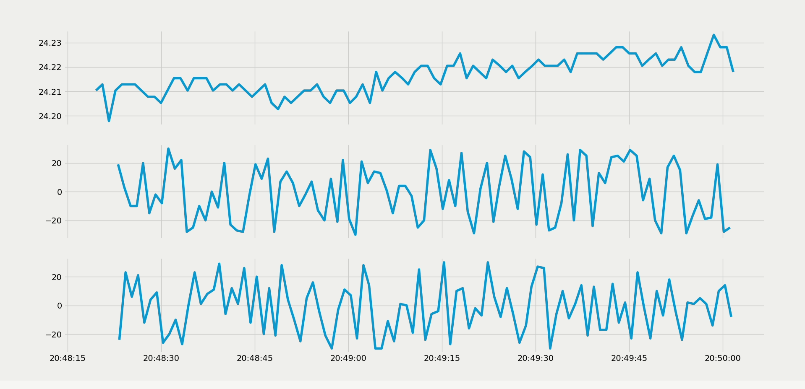

# DS-Himmeli
Course project for 521290S Distributed Systems


*Dashboard program output with one Rasberry Pi transmitting real data from a BMP280 sensor, and two dummy clients transmitting random data. MQTT broker is running in an Amazon EC2 instance.*

## Demo
Following Python modules are required:
```
paho-mqtt
matplotlib
```

MQTT broker used is mosquitto, which needs to be installed.


Start demo, which will start mosquitto MQTT broker, 3 sensor nodes and data visualizer:
```bash
chmod +x demo_script.sh
./demo_script.sh
```

Set sensor state to be on or off:
```bash
#on
mosquitto_pub -h <hostname> -t config/state -m 1
#off
mosquitto_pub -h <hostname> -t config/state -m 0
```

Change sensor data reporting period (value in seconds, default is 1):
```bash
mosquitto_pub -h <hostname> -t config/period -m <value>
```

## RasPi deployment
To use with BMP280 sensor connected to a Raspberry Pi device, change the following flag to 1:
```python
#Set to 1 if BMP280 sensor is connected to device
REAL_SENSOR = 0
```

## Client program usage
Start your nodes with
```bash
python client/client.py <hostname> <client_id>
```
where hostname is the host name of your MQTT broker, and client_id is either 1, 2 or 3.

## Dashboard program usage
Start the sensor data visualizer with
```bash
python dashboard/dashboard.py <hostname>
```
where hostname is the host name of your MQTT broker.
## MQTT broker deployment to Amazon EC2
1. Launch EC2 instance from EC2 dashboard, e.g. Amazon Linux 2 AMI instance should work fine.
2. Connect to EC2 instance via SSH, and run following commands to install Mosquitto (commands may differ if you chooce different AMI):
```bash
sudo amazon-linux-extras install epel
sudo yum -y install mosquitto
```
3. Allow inbound TCP for port 1883 for MQTT.
4. Launch Mosquitto with:
```bash
mosquitto
```
5. After that, just connect your clients and dashboard program to the hostname of your EC2 instance.


